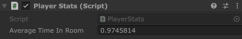
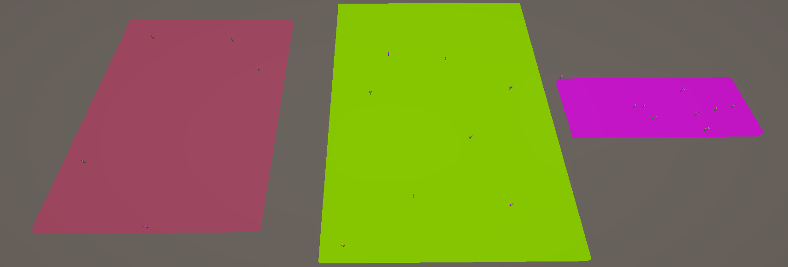
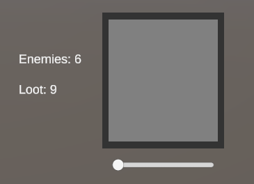
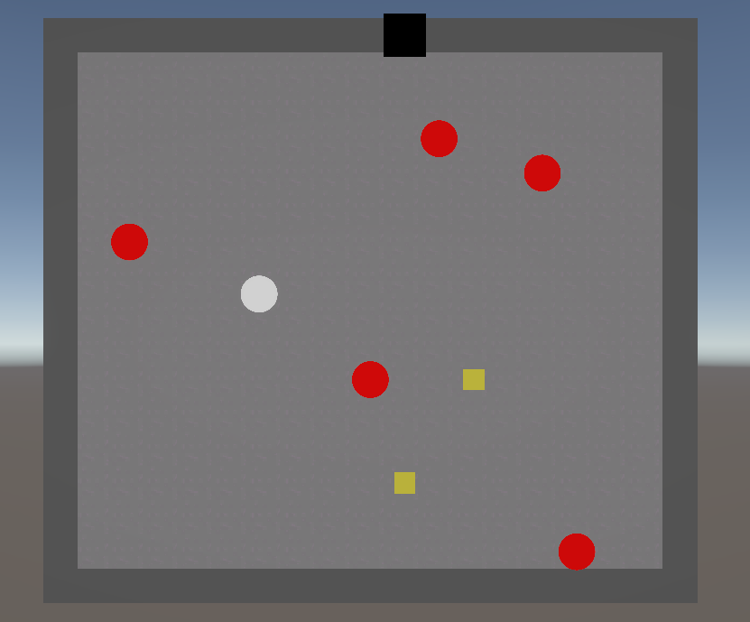

# Development Log – COMP302 Dissertation
**Project:** Procedural Generation / Genetic Algorithm Project  
**Author:** Bradley Jeffs                        
**Period Covered:** 30/09/2025 – 12/12/2025

---

## Overview
This development log documents the ongoing progress of the project. The log is structured chronologically with clear technical notes.

---

#  Table of Contents
1. [Iteration 1](#Iteration-1)
2. [Iteration 2](#Iteration-2)
3. [Iteration 3](#Iteration-3)

---

# **Iteration 1** <a name="Iteration-1"></a>

### Tasks Completed
- Set up Unity project and Git repository.  
- Created genetic algorithm where the fitness function is based on the time the player spends in the room.
- Player stat tracking
- Simple room generation based on genetic algorithm results.

### Design

The project to create is a game where a room will be generated through a genetic algorithm, and then the player will be placed into the room, and then player stats, such as time spent in room, will be recorded and used for calculating the fitness function. 

A Genetic Algorithm is chosen as it is an under-utilized method of PCG, and it will be used to evidence my study of using a Genetic Algorithm with PCG. Rooms were chosen to allow for many different stats to be tracked in the future, when a player is added and things to interact with.

To enable the genetic algorithm, a RoomDNA class was made with two evolving trates: roomWidth and roomLength. This dictates the length and width of the room.
Each RoomDNA object starts with a random roomLength and roomWidth.

```csharp
public class RoomDNA
{
    public float roomWidth;
    public float roomLength;

    public RoomDNA()
    {
        roomLength = Random.Range(5, 50);
        roomWidth = Random.Range(5, 50);
    }
}
```

In RoomDNA, there is also functions for mutation and crossover. The Crossover() function takes a different RoomDNA as a parameter, then produces a child DNA by randomly choosing each gene from one of the parents.

```csharp
public RoomDNA Crossover(RoomDNA other)
{
    RoomDNA child = new RoomDNA();
    child.roomWidth = Random.value < 0.5f ? roomWidth : other.roomWidth;
    child.roomLength = Random.value < 0.5f ? roomLength : other.roomLength;

    return child;
}
```

The Mutate() function has a random chance to mutate each gene based on a mutation rate, where mutating randomly sets the gene again.

```csharp
public void Mutate(float rate)
{
    if (Random.value < rate) roomWidth = Random.Range(5, 30);
    if (Random.value < rate) roomLength = Random.Range(5, 30);
} 
```
The next class's created is a PlayerStats and a RoomDataCollection class, which are simple classes, responsible for tracking player stats. For now, it only tracks the players time spent in a room, and then averages the time spent in all the rooms. 



The final class created, is a GenerateRoom class, which runs the genetic algorithm and generates the room.

When initialized, a list of RoomDNA individuals is created, which forms the starting population for evolution
```csharp
for (int i = 0; i < populationSize; i++)
    population.Add(new RoomDNA());
```

Then, the fitness function is calculated. Currently, fitness is calculated by comparing how close the room’s estimated traversal time is to the player's average time.

```csharp
float estimatedTime = (dna.roomWidth * dna.roomLength) / 100f;
fitness -= Mathf.Abs(estimatedTime - playerStats.averageTimeInRoom);
```

After that, the population is sorted by fitness, from best to worst, and the top 50% survive for the next population. Then, the next 50% are generated using the survivors as parents for the Crossover() and Mutate() functions mentioned earlier.

```csharp
RoomDNA child = parent1.Crossover(parent2);
child.Mutate(mutationRate);
```
Once all generations are complete, the highest ranked RoomDNA is chosen, and the room is generated by creating a floor object with the length and width that matches the RoomDNA.
```csharp
GameObject floor = Instantiate(floorPrefab, Vector3.zero, Quaternion.identity, gameObject.transform);
floor.transform.localScale = new Vector3(roomDNA.roomWidth, 1f, roomDNA.roomLength);
```


### Challenges and Resolutions

One of the current challenges is premature convergence, as the rooms converge to a single type of room every time. To fix this, a new method of selection will be needed, such as Roulette-Wheel Selection, which will be worked on in future renditions.

Another challenge is figuring out which stats to track to create the best results, and without creating an overcumbersome fitness function, as having lots of different variables to evolve could be difficult to evenly balance. To fix this, a method will be developed to automatically balance all variables impact on the fitness function.

---

# **Iteration 2** <a name="Iteration-2"></a>

### Tasks Completed
- Reworked project design.
- Multiple generation variables.
- Multiple generation choices.

### Design

The project has been reworked to a garden generation simulator. The player is presented with 3 garden generated by a genetic algorithm, and the player picks the one they like the most, and the variables of that garden is fed into the genetic algorithms fitness function.

The project was reworked because of the dissertation change from studying a genetic algorithm PCG method, to studying player-guided PCG. The previous version was player-guided, however the player did not get to choose the generation result, and tracked the player instead which didn't involve any input from the player during the generation process.

One of the classes changed is the RoomDNA class, which now has variables for the colour of the garden floor and the number of flowers in the garden.

```csharp
roomLength = Random.Range(5, 50);
roomWidth = Random.Range(5, 50);
roomColour = new Color(Random.Range(0, 1f), Random.Range(0, 1f), Random.Range(0, 1f));
roomFlowers = Random.Range(0, 10);
```

Another class changed is the RoomGeneration class, which now generates 3 rooms compared to the previous iterations 1 room. It follows the same Genetic Algorithm method, but now picks the top 3 ranked rooms to generate.

```csharp
currentCandidates = population.OrderByDescending(dna => EvaluateFitness(dna, roomData)).Take(3).ToList();
GenerateMultiple(currentCandidates);
```



Additionally, the fitness function is expanded as multiple variables are now calculated.

```csharp
float EvaluateFitness(RoomDNA dna, RoomData previousRoomData)
{
    float fitness = 1f;

    float widthStrength = 0.15f;
    float widthDifference = Mathf.Abs((dna.roomWidth - previousRoomData.roomWidth) / 100f);
    fitness -= widthDifference * widthStrength;

    float lengthStrength = 0.15f;
    float lengthDifference = Mathf.Abs((dna.roomLength - previousRoomData.roomLength) / 100f);
    fitness -= lengthDifference * lengthStrength;

    float colourStrength = 0.5f;
    float colorDifference = Mathf.Abs(Vector3.Distance(
        new Vector3(dna.roomColour.r, dna.roomColour.g, dna.roomColour.b),
        new Vector3(previousRoomData.roomColour.r, previousRoomData.roomColour.g, previousRoomData.roomColour.b)
    ) * colourStrength);
    fitness -= colorDifference;

    float flowerStrength = 1f;
    float flowerDifference = Mathf.Abs(((dna.roomFlowers - previousRoomData.roomFlowers) / 10f) * flowerStrength);
    fitness -= flowerDifference;

    return Mathf.Max(0f, fitness);
}
```

Once the player chooses their preffered room, the RoomDataCollection class, which has been reworked, tracks the variables of the room, and then passes it back to the GenerateRoom class as the previouseRoomData, as shown above.

```csharp
public void StartDataCollection(RoomDNA roomDNA)
{
    roomWidth = roomDNA.roomWidth;
    roomLength = roomDNA.roomLength;
    roomColour = roomDNA.roomColour;

    flowers = roomDNA.roomFlowers;
}

public RoomData EndDataCollection()
{
    return new RoomData(roomWidth,roomLength,roomColour,flowers);
}
```


To generate the rooms, the floor generated is now set to the colour of the RoomDNA, and then a number of flowers from the RoomDNA is randomly placed in the garden.

```csharp
private void GenerateSingle(RoomDNA dna, Vector3 offset)
{
    GameObject floor = Instantiate(floorPrefab, offset, Quaternion.identity, gameObject.transform);
    floor.transform.localScale = new Vector3(dna.roomWidth, 1f, dna.roomLength);

    Material mat = new Material(Shader.Find("Universal Render Pipeline/Unlit"));
    mat.SetColor("_BaseColor", dna.roomColour);
    floor.GetComponent<Renderer>().material = mat;

    for (int i = 0; i < dna.roomFlowers; i++)
    {
        float x = Random.Range(-dna.roomWidth / 2f, dna.roomWidth / 2f);
        float z = Random.Range(-dna.roomLength / 2f, dna.roomLength / 2f);
        Vector3 pos = new Vector3(x, 0.5f, z) + offset;

        GameObject flower = Instantiate(flowerPrefab, pos, Quaternion.identity, gameObject.transform);
        flower.transform.Rotate(Vector3.up * Random.Range(0f, 360f));
    }
}
```


### Challenges and Resolutions

One of the current challenges is still premature convergence, as the rooms converge to a single type of room every time. To fix this, a new method of selection will be needed, such as Roulette-Wheel Selection, which will be worked on in future renditions.

Another challenge is still having lots of different variables to evolve, which is difficult to evenly balance. To fix this, a method will be developed to automatically balance all variables impact on the fitness function.

Another challenge is trying to increase player agency in the generation process, as it currently is still primitive and simple. To fix this, there will be more options for the player to tweak the PCG.

---

# **Iteration 3** <a name="Iteration-3"></a>

### Tasks Completed
- Reworked and finalised project design.
- Direct player involvment through the Genetic Algorithm.
- Controllable character with simple objectives.


### Design

The project has been reworked again to a dungeon-crawling-style game, where the player will move from room to room. Each room will have enemies that the player will have to defeat, as well as loot that the player can acquire, and each room will also be a different scale. The player is presented with every RoomDNA in the population, and can rank them individually.

The project was reworked because of the slight dissertation shift to a higher emphasis on player agency, as well as the fact that the previous iteration still lacked much player choice, with limited ways to expand. There was also not much data to record for the study with the previous iteration, so a more interactive experience was chosen.

One of the classes changed is the RoomDNA class, which now has variables for the enemy count and loot count.

```csharp
public RoomDNA()
{
    roomLength = Random.Range(5, 25);
    roomWidth = Random.Range(5, 25);
    enemyCount = Random.Range(1, 10);
    lootCount = Random.Range(1, 10);
}
```

Another class changed is the RoomGeneration class, which now generates previews of all rooms in the population, as opposed to fully generating each candidate. It calls the new PreviewData function for each candidate, which sets up a preview.

```csharp
public class PreviewData : MonoBehaviour
{
    public Slider slider;
    public RawImage rawImage;
    public GameObject selectButton;

    public TMP_Text enemyCount;
    public TMP_Text lootCount;

    public RoomDNA roomDNA;

    private GenerateRoom roomGenerator;

    private void Start()
    {
        roomGenerator = FindFirstObjectByType<GenerateRoom>();
    }

    public void Init()
    {
        enemyCount.text = "Enemies: " + roomDNA.enemyCount.ToString();
        lootCount.text = "Loot: " + roomDNA.lootCount.ToString();
    }

    public void RoomSelected()
    {
        roomGenerator.GenerateChosen(roomDNA);
    }

    public void UpdateFitness()
    {
        roomDNA.fitness = Convert.ToInt32(slider.value);
    }

 }
```



Additionally, the fitness function is changed to be directly proportionate to the players ranking of the room, which is a Likert Scale from 1-5, changable with a slider.

```csharp
float EvaluateFitness(RoomDNA dna)
{
    return dna.fitness;
}
```

A new selection method is now used, which is a Roulette-Wheel Selection method, with higher ranked candidates being more likely to be chosen, however it is no longer guarenteed, allowing for variation and less premature convergance.

```csharp
private RoomDNA RouletteWheelSelect(List<RoomDNA> pool)
{
    float totalFitness = 0f;
    foreach (var dna in pool)
        totalFitness += EvaluateFitness(dna);

    float randomPoint = Random.value * totalFitness;

    float cumulative = 0f;
    foreach (var dna in pool)
    {
        cumulative += EvaluateFitness(dna);
        if (cumulative >= randomPoint)
            return dna;
    }

    return pool[pool.Count - 1];
}
```
Once every generation is complete, of which the player is involved in every one, all rooms from the last generation can be chosen to be generated. To generate the room, the floor is now generated using a 2D tileset, and walls are placed along the perimeter. Then, an exit is placed at a random tile on the walls, with enemies and loot being placed on random floor tiles.





### Challenges and Resolutions

One of the current challenges is balancing user fatigue, as having to rank every room can become cumbersome. To fix this, the amount of generations will be changable in the future.

Another challenge is creating a good gameplay experience, this will be done with a combat system, and a simplistic looting system in future iterations.

---

### Conclusion

This project has gone through multiple iterations, however the current design is the strongest at providing a strong player agency. Future iterations will provide a full gameplay experience, with more polish, to feel a sense of reward after generating a room.

### Future Work

- Combat system
- Loot system
- Polished UI and visuals
- More variety in levels
  
